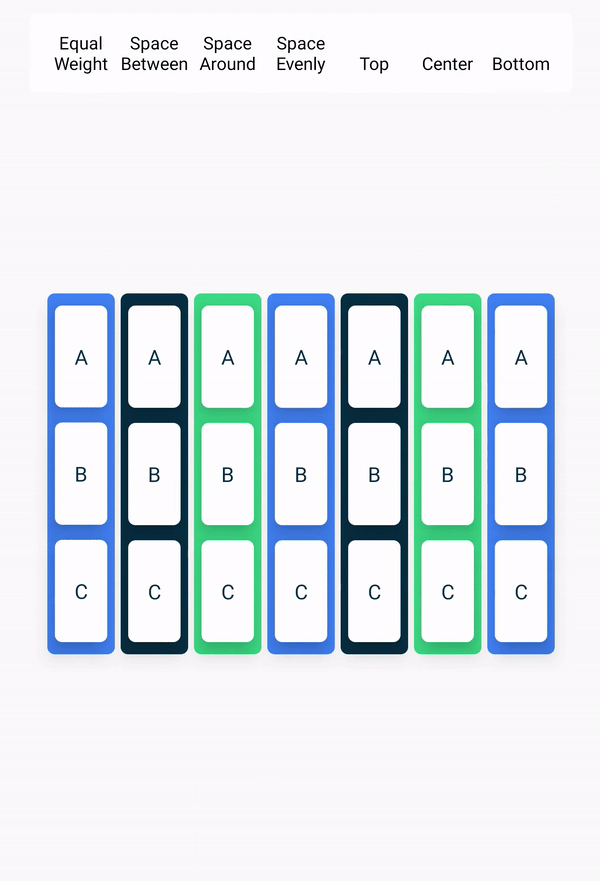

# Android Jetpack Compose 中的修饰符：装饰与行为增强
- Jetpack Compose 是用于构建原生 Android 界面的新款工具包
- Compose 是一个声明性界面框架,这意味着您可以在代码中声明界面的外观和行为，而无需编写大量的代码。
- 官网连接：https://developer.android.com/develop/ui/compose/documentation?hl=zh-cn
- 在 Jetpack Compose 中，修饰符(Modifier)是构建 UI 的核心概念之一。它们允许开发者以声明式方式为界面元素添加视觉装饰或行为功能，而不需要创建新的组件。本文将深入探讨修饰符的使用，特别是如何结合 Column 和 Row 这两个常用的盒子布局来应用修饰符。
- Compose 应用调用**可组合函数**，以将数据转换为界面。如果发生状态更改，Compose 会使用新状态**重新执行受影响的可组合函数**，从而创建更新后的界面。这一过程称为“重组”

## 修饰符基础

修饰符是一个可组合的函数，可以链接在一起形成修饰符链。它们可以用于：

- 添加视觉装饰(如背景、填充、边框)
- 改变布局行为(如大小约束、对齐方式)
- 添加交互行为(如点击、手势)
- 添加语义信息(如无障碍支持)

### 基本语法

```kotlin
Text(
    text = "Hello Compose",
    modifier = Modifier
        .padding(16.dp)
        .background(Color.Blue)
        .clickable { /* 处理点击 */ }
)
```

### Column 和 Row布局简介
在深入修饰符之前，先简单回顾一下 Column 和 Row 这两个基本布局：
1. Column：垂直布局，子元素从上到下排列,Column 将子元素垂直排列(沿 Y 轴)，类似于线性布局的垂直方向。
```kotlin
Column(
    modifier = Modifier.fillMaxSize()
) {
    Text("第一项")
    Text("第二项")
    Text("第三项")
}
```
2. Row：水平布局，子元素从左到右排列,Row 将子元素水平排列(沿 X 轴)，类似于线性布局的水平方向。
```kotlin
Row(
    modifier = Modifier.fillMaxWidth()
) {
    Text("左侧")
    Text("右侧")
}
```
### 修饰符在 Column 和 Row 中的应用
#### 1.布局修饰符
 **对齐方式**：
```kotlin
Column(
    modifier = Modifier
        .fillMaxSize()
        .padding(16.dp),
    verticalArrangement = Arrangement.Center, // 垂直居中
    horizontalAlignment = Alignment.CenterHorizontally // 水平居中
) {
    Text("垂直和水平居中")
}
```
```kotlin
Row(
    modifier = Modifier
        .fillMaxWidth()
        .padding(16.dp),
    horizontalArrangement = Arrangement.SpaceBetween, // 子元素两端对齐
    verticalAlignment = Alignment.CenterVertically // 垂直居中
) {
    Text("左侧")
    Text("右侧")
}
```
布局图片如下：
**Column盒子排列方式**

**Row盒子排列方式**


**大小约束**：
```kotlin
Column(
    modifier = Modifier
        .widthIn(min = 100.dp, max = 300.dp) // 宽度限制
        .height(200.dp) // 固定高度
) {
    // 子元素
}
```

### 总结
修饰符是 Jetpack Compose 中强大而灵活的工具，可以优雅地为界面元素添加视觉装饰和交互行为。结合 Column 和 Row 这两个基础布局，修饰符可以帮助开发者构建出既美观又功能丰富的用户界面。通过合理使用修饰符，可以减少自定义组件的需求，提高代码的可重用性和可维护性。

记住，修饰符可以链式调用，顺序很重要 - 后添加的修饰符会包裹前面的修饰符，这会影响它们的应用方式。理解这一点对于有效使用修饰符至关重要。
[Android练习地址](https://developer.android.com/codelabs/basic-android-kotlin-compose-add-images?hl=zh-cn&continue=https%3A%2F%2Fdeveloper.android.com%2Fcourses%2Fpathways%2Fandroid-basics-compose-unit-1-pathway-3%3Fhl%3Dzh-cn%23codelab-https%3A%2F%2Fdeveloper.android.com%2Fcodelabs%2Fbasic-android-kotlin-compose-add-images#4)