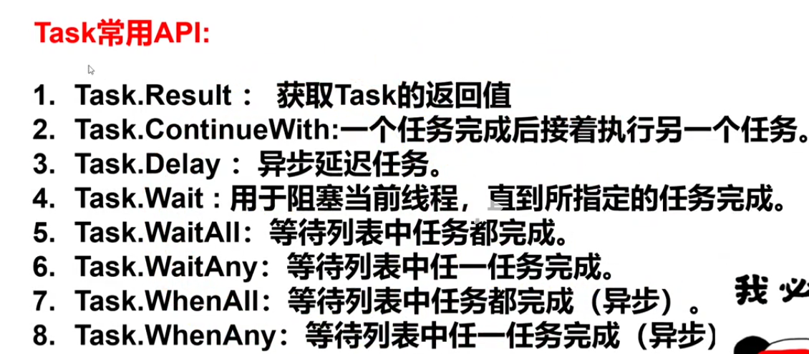

# 多线程与异步概述

### 多线程(Thread)
多线程是操作系统提供的一种并发执行的机制，它允许程序同时执行多个任务，每个任务称为线程。由cpu调度，线程是cpu调度执行的最小单元。
- Thread类是.net提供的多线程类，它是ThreadPool的封装，ThreadPool是.net提供的线程池，用于管理线程的创建和回收。
- Thread创建的线程默认都是前台线程,前台线程会阻塞整个应用程序进程，后台线程不会。
- 线程的创建和回收
  - 创建线程：Thread类提供的Start方法，用于启动线程的执行。
  - 回收线程：Thread类提供的Join方法，用于等待线程执行完毕，然后回收线程。
- 线程的状态
  - 新建：线程刚被创建，但还未启动。
  - 就绪：线程已经准备好运行，但还未分配到cpu资源。
  - 运行：线程正在运行。
  - 阻塞：线程正在等待某个事件发生，如等待IO操作完成。
  - 终止：线程执行完毕，正在等待回收。


### 线程的常用属性
1. Name：线程名称,用于获取和设置线程的名称。
2. IsAlive：线程是否存活，用于判断线程是否已经启动并运行。
3. IsBackground：是否为后台线程，用于设置线程是否为后台线程。
4. Priority：线程优先级，用于获取和设置线程的优先级。
5. ManagedThreadId：线程ID，用于获取线程的唯一标识符。
6. ThreadState：线程状态，用于获取线程的当前状态。

- 线程的创建示例代码
```csharp
public class TestThread
{
    public void StartThread()
    {
        //创建线程
        //第二个参数是指定该线程的最大内存控件,单位是字节，1024=1kb
        Thread thread = new Thread(WorkThread,1024);
        //启动线程
        thread.Start();
        
        //可以传参数的线程，用lambda包裹一层
        int[] arrInts = [1,2,3,4,5,6];
        Thread thread2 = new Thread(() =>
        {
            PrintArrayItemThread(arrInts);
        });
        thread2.Start();
        
        Console.WriteLine("主线程结束");
    }

    /// <summary>
    /// 工作线程1-无参无返回值
    /// </summary>
    private void WorkThread()
    {
      //Thread.CurrentThread--表示当前线程的对象
       Console.WriteLine(Thread.CurrentThread.Name);
        for (int i = 0; i < 10; i++)
        {
            Console.WriteLine($"工作线程1执行=>${i}");
        }
    }

    /// <summary>
    /// 工作线程2
    /// </summary>
    /// <param name="arrInts"></param>
    private void PrintArrayItemThread(int[] arrInts)
    {
        if (arrInts.Length > 0)
        {
            foreach (var item in arrInts)
            {
                Console.WriteLine($"工作线程2=>${item}");
            }
        }
    }
}
```

### 线程的调度
- 线程调度是操作系统根据线程的优先级、线程的状态、线程的等待时间等因素，决定将cpu分配给哪个线程执行的过程。
- 都是相当于当前线程来操作的

1. 线程的优先级：Thread.Priority属性，用于获取和设置线程的优先级。
2. 线程的礼让：Thread.Yield方法，用于让出cpu资源，让其他线程执行。
3. 线程的挂起和恢复：Thread.Suspend和Thread.Resume方法，用于挂起和恢复线程的执行。
4. 线程的等待：Thread.Sleep方法，用于让线程等待一段时间，然后继续执行。
5. 线程的阻塞：Thread.Join方法，用于当该线程执行结束后，然后继续执行，阻塞线程。
6. 线程的取消：Thread.Cancel方法，用于取消线程的执行。
7. 线程的终止：Thread.Abort方法，用于终止线程的执行。

### 线程安全
- 线程安全是多线程环境下，多个线程同时访问同一个资源时，会出现数据不一致的情况。
- 线程安全的实现方式：
  - 使用锁：使用lock关键字来实现线程安全，lock关键字是.net提供的关键字，用于实现线程安全。
  - 使用原子操作：使用Interlocked类提供的原子操作方法，如Interlocked.CompareExchange方法，用于实现线程安全。
  - 使用线程安全的集合：使用线程安全的集合类，如ConcurrentDictionary类，用于实现线程安全。
  - 使用线程安全的数据结构：使用线程安全的数据结构，如ConcurrentQueue类，用于实现线程安全。
  - 使用线程安全的算法：使用线程安全的算法，如ConcurrentBag类，用于实现线程安全。

1. 使用lock(Object)关键字实现线程安全,Object是锁的标识符，用于标识锁的唯一性。
```csharp

public class Ticket
{
    private readonly int _totalTicketCount = 10;
    private int _currentTicketCount = 10;
    
    private readonly Object o = new Object();//对象锁

    public void GetTicket()
    {
        while (true)
        {
            lock (o)
            {
                if (_currentTicketCount<=0)
                {
                    break;
                }
                _currentTicketCount--;
                Thread.Sleep(100);
                Console.WriteLine($"{Thread.CurrentThread.Name}抢到了第{_totalTicketCount-_currentTicketCount}张票，还剩{_currentTicketCount}张票");
            }
        }
    }
}
```


### 异步(Async)
异步是多线程的一种高级形式，它允许程序在不阻塞主线程的情况下执行其他任务。

### Task---跟Promise类似
- Task是.net提供的异步编程模型，它是.net提供的**异步**编程的核心类，用于表示异步任务的执行状态和结果。不会阻塞主线程
- 对多线程编程的高级抽象
- 基于线程池来实现(ThreadPool)
- 和Thread的区别就是，Thread创建的是系统级别的线程，而Task创建的是.net 提供线程池的线程，用于管理线程的创建和回收。task创建的线程默认是后台线程

#### 1.1 Task创建的三种方式

```csharp
 public void StartTask()
   {
      // 1.跟Thread创建的方式一样，lambda方式，然后start,默认是后台线程
      Task task = new Task(() =>
      {
         Console.WriteLine($"{Thread.CurrentThread.Name},isPool:{Thread.CurrentThread.IsThreadPoolThread}");
      });
      task.Start();
      
      //2.静态方法
      Task.Run(() =>
      {
         Console.WriteLine("task线程启动");
      });
      //3.工厂方法
      TaskFactory tf = new TaskFactory();
      tf.StartNew(() =>
      {
         Console.WriteLine("task线程启动");
      });

      //返回值都是TasK
   }
```

#### 1.2 Task常用的Api


#### 1.3 async关键字
- 异步编程的核心是async和await关键字，async关键字用于修饰方法，表示该方法是异步的，await关键字用于修饰异步方法的调用，等待异步完成。

```csharp
//默认返回一个Task对象
public async Task TestAsync()
{
  //await 后面开始另外一个控制流，当前线程继续执行，等到异步完成后，再继续恢复当前控制流
  await Task.Delay(100);
}
```
