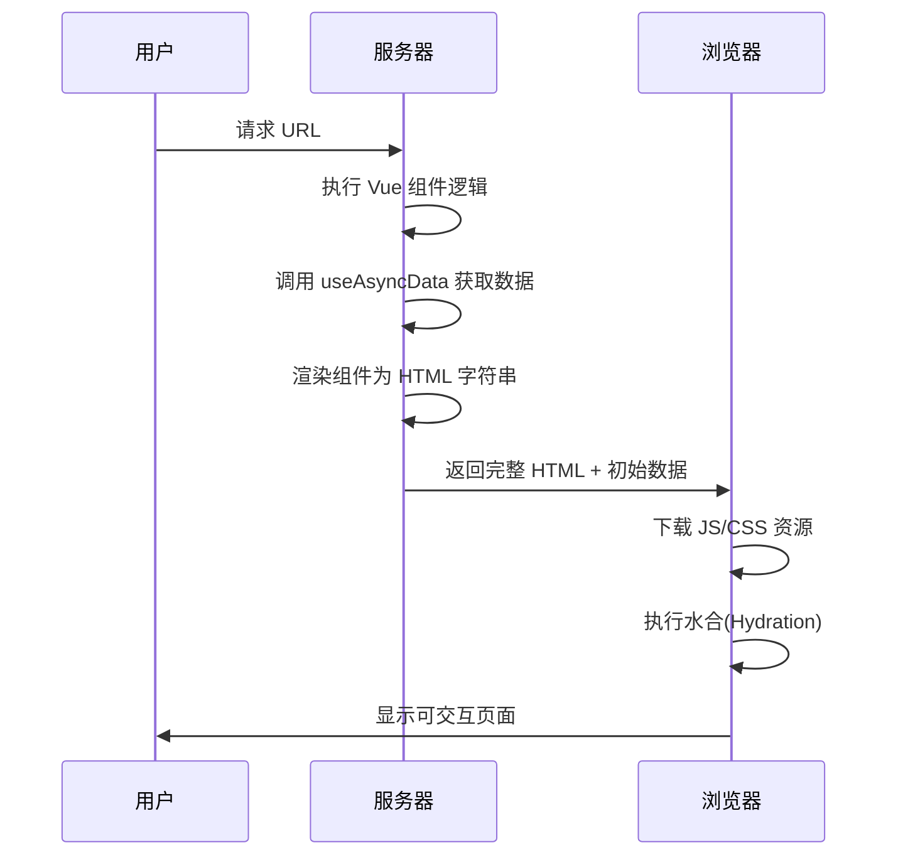

# Nuxt.js 全解析：SSR 与水合机制深入理解

## 前言：现代 Web 开发的挑战

在单页应用（SPA）主导的时代，开发者面临两大核心挑战：
1. **SEO 不友好**：搜索引擎爬虫难以抓取纯 JavaScript 渲染的内容
2. **首屏性能瓶颈**：大型应用需要加载完整 JS 才能显示内容

Nuxt.js 正是为解决这些问题而生，它通过 **服务端渲染(SSR)** 和 **智能水合(Hydration)** 机制实现了二者兼得。

## 一、Nuxt.js 是什么？

### 1.1 核心定位
Nuxt.js 是基于 Vue.js 的**全栈框架**，它提供：
- 📁 **约定式路由**：基于文件目录自动生成路由
- ⚙️ **服务端渲染**：开箱即用的 SSR 支持
- 📦 **模块化架构**：200+ 官方/社区模块扩展功能
- 🚀 **现代化工具链**：Vite、Webpack 5 支持

### 1.2 Nuxt vs Vue 核心差异
| 特性         | Vue.js (SPA)       | Nuxt.js (SSR)         |
|--------------|-------------------|----------------------|
| 路由         | 需手动配置        | 文件目录自动生成     |
| 数据获取     | 客户端 `onMounted`| 服务端 `useAsyncData`|
| SEO 支持     | 差                | 优秀                 |
| 首屏性能     | 慢                | 快（直接返回 HTML）  |
| 部署复杂度   | 低（仅静态文件）  | 中（需 Node 环境）   |

## 二、SSR：服务端渲染原理剖析

### 2.1 什么是 SSR？
**服务端渲染(Server-Side Rendering)** 是指在服务器上提前执行 JavaScript，生成完整的 HTML 页面并返回给浏览器。

### 2.2 工作流程


### 2.3 SSR 核心优势
1. **SEO 优化**：爬虫直接获取完整内容
2. **首屏性能提升**：用户立即看到内容，无需等待 JS 加载
3. **低带宽设备友好**：减少客户端计算负担

## 三、水合(Hydration)：SSR 的关键环节

### 3.1 为什么需要水合？
虽然 SSR 返回了完整的 HTML，但它只是"静态快照"。水合作用是将静态页面"激活"为动态应用的关键步骤。

### 3.2 水合工作原理
1. **DOM 匹配**：Vue 比较服务端生成的 DOM 和客户端虚拟 DOM
2. **数据恢复**：从 `window.__NUXT__` 恢复响应式状态
3. **事件绑定**：为现有元素添加 Vue 事件监听器
4. **实例接管**：Vue 实例全权控制页面

### 3.3 水合错误处理
当服务端和客户端渲染不一致时，会出现警告：
```bash
[Hydration text mismatch] 
  - Server: "123"
  - Client: "456"
```
**常见原因**：
- 使用了 `Math.random()` 等不确定性方法
- 在顶层访问了浏览器 API（`window`/`document`）
- 异步数据未正确处理

### 3.4 水合最佳实践
```vue
<template>
  <div>
    <!-- 服务端和客户端渲染一致 -->
    <p>静态内容: {{ data }}</p>
    <!-- 仅客户端交互 -->
    <button @click="count++" v-if="mounted">点击</button>
  </div>
</template>

<script setup>
//setup函数会在nuxt的声明周期中执行
//同样在客户端水合阶段也会执行
//共同的逻辑可以放在setup顶层
const { data } = await useAsyncData('key', () => fetchData()); // 服务端预取
const count = ref(0);
const mounted = ref(false);

onMounted(() => {
  mounted.value = true; // 确保客户端才渲染按钮
});
</script>
```

## 四、Nuxt 中的 SSR 实践

### 4.1 数据获取的正确方式
```javascript
// 服务端安全获取数据
const { data } = await useAsyncData('key', async () => {
  return $fetch('/api/data')
})

// 仅客户端操作
onMounted(() => {
  console.log('只在浏览器执行')
})
```

### 4.2 生命周期处理
| 钩子函数        | 执行环境       | 注意事项                    |
|----------------|--------------|---------------------------|
| `setup()`      | 服务端 + 客户端 | 避免浏览器专属 API         |
| `onMounted()`  | 仅客户端       | 安全操作 DOM 的位置        |
| `onServerPrefetch()` | 仅服务端     | Nuxt 特有，预取服务端数据 |

### 4.3 企业级项目架构
```
├── pages/             # 自动路由
├── components/         # 通用组件
├── composables/        # 复用逻辑
├── server/            
│   ├── api/           # API 路由
│   ├── middleware/    # 服务端中间件
├── nuxt.config.ts      # 全局配置
```

## 五、部署策略与优化

### 5.1 部署方案对比
| 部署方式        | 适用场景             | 案例平台          |
|----------------|---------------------|------------------|
| Node 服务器     | 高流量动态网站       | AWS EC2, DigitalOcean |
| Serverless     | 弹性伸缩，成本优化   | Vercel, AWS Lambda     |
| 静态托管        | 内容不变网站 (SSG)  | Netlify, GitHub Pages  |

### 5.2 性能优化技巧
1. **组件级水合**：使用 `<ClientOnly>` 包装无需 SSR 的组件
   ```vue
   <ClientOnly>
     <BannerAd /> <!-- 仅在客户端渲染 -->
   </ClientOnly>
   ```
2. **延迟加载**：对非核心组件使用异步导入
   ```javascript
   const HeavyComponent = defineAsyncComponent(() => 
     import('./HeavyComponent.vue')
   )
   ```
3. **缓存策略**：对静态内容设置 `Cache-Control` 头

## 六、未来展望：Nuxt 3 的创新

1. **Nitro 引擎**：跨平台 Serverless 支持
2. **岛屿架构**：按需水合的混合渲染模式
3. **DevTools 增强**：可视化调试 SSR 与水合过程

## 结语：选择 Nuxt 的时机

在以下场景选择 Nuxt.js 将事半功倍：
- 🔍 需要 SEO 优化的内容网站（博客、电商）
- ⚡ 对首屏性能有严苛要求的应用
- 🧩 大型团队需要标准化工程架构

## 生命周期示例图
<ImageViewer src="../../../assets/images/nuxtLifeCircle.png" />
<ImageViewer src="../../../assets/images/nuxtLifeCircle2.png" />